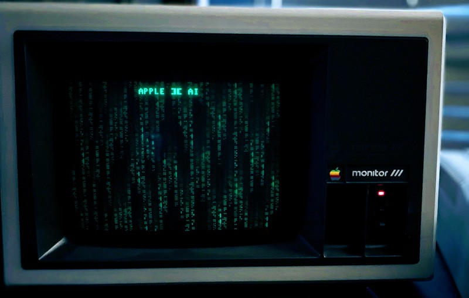

# APPLE2-AI

Talk to Google Gemini from an Apple II — in 6502 assembly, over bare-metal TCP/IP.

This project is a native Apple II client written entirely in 6502 assembly that negotiates a raw TCP handshake via an Uthernet II ethernet card, connects through a lightweight Python proxy to the Gemini API, and streams AI responses to an 80-column Videx Ultraterm terminal — all on a 1MHz 8-bit machine.



## Features

- **Bare-Metal TCP/IP** — Direct W5100 register manipulation on the Uthernet II. No IP stack, no library, no OS. Just `STA $C0A7`.
- **HGR2 Boot Screen** — Full-screen hi-res digital rain effect with character reveal, written in unrolled 6502 with a shadow buffer and self-modifying dispatch.
- **Split-Screen UI** — Hardware soft-switch transitions: HGR2 graphics → 40-column config/diagnostics → 80-column Ultraterm chat.
- **6-Step Network Diagnostics** — W5100 reset, version register check, indirect mode, source IP assignment, socket open, and TCP connect — all reported on screen before entering chat.
- **Streaming Proxy** — Python 3 middleware handles TLS 1.3, Gemini API framing, real-time streaming, uppercase conversion, and 79-column word wrap.
- **Persistent Config** — Server IP saved to Garrett's Workshop 128K RAM card across power cycles.
- **ROMX Compatible** — Explicit ROM vector reset (`JSR $FE89` / `JSR $FE93`) prevents conflicts with ROMX video hooks.

## Hardware Requirements

| Component | Slot | Required |
|---|---|---|
| Apple II (Rev 3 tested) or Apple IIe | — | Yes |
| [Uthernet II](http://a2retrosystems.com/products.htm) Ethernet Card | **Slot 2** | Yes |
| [Videx Ultraterm](https://mirrors.apple2.org.za/Apple%20II%20Documentation%20Project/Interface%20Cards/Parallel/Videx%20Ultraterm/) 80-Column Card | **Slot 3** | Yes |
| [Garrett's Workshop 128K](https://garrettsworkshop.com/) RAM Card | Slot 0 | No (IP config won't persist) |

> Tested with AppleWin emulator for development, deployed on real Rev 3 hardware via ROMX.

## Architecture

```
┌─────────────┐    TCP :5000     ┌──────────────┐   HTTPS/TLS 1.3   ┌────────────┐
│  Apple II   │ ──────────────── │ Python Proxy │ ───────────────── │ Gemini API │
│  (6502 asm) │  Plain ASCII     │ (proxy.py)   │  JSON + Streaming │ (Google)   │
│  1 MHz      │  LAN only        │ Your PC/Pi   │  Word wrap + UC   │            │
└─────────────┘                  └──────────────┘                   └────────────┘
```

The Apple II can't do TLS, parse JSON, or handle Unicode. The proxy bridges that gap:

1. **Apple II → Proxy**: Raw ASCII text over an unencrypted local TCP socket.
2. **Proxy → Gemini**: Wraps the text in a secure HTTPS request to the Gemini API.
3. **Gemini → Proxy → Apple II**: Strips markdown, converts smart quotes to plain ASCII, word-wraps to 79 columns, and streams bytes back in real time.

## Getting Started

### Part 1: Python Proxy

You need a machine on your LAN (PC, Mac, Linux, Raspberry Pi) to relay traffic.

1. Install the Google GenAI SDK:
   ```
   pip install google-genai
   ```

2. Get a free API key from [Google AI Studio](https://aistudio.google.com/apikey).

3. Set your API key as an environment variable:
   ```bash
   # Linux / macOS
   export GEMINI_API_KEY="your_api_key_here"

   # Windows (Command Prompt)
   set GEMINI_API_KEY=your_api_key_here
   ```

4. Run the proxy:
   ```
   python3 proxy/gemini-proxy.py --host 0.0.0.0 --port 5000 --model gemini-2.0-flash
   ```

### Part 2: Building the Apple II Client

The source is written for the [cc65](https://cc65.github.io/) toolchain (`ca65` assembler + `ld65` linker).

1. Install [cc65](https://cc65.github.io/getting-started.html).

2. Build:
   ```
   make
   ```
   Or manually:
   ```
   ca65 src/apple2-ai.s -o build/apple2-ai.o
   ld65 -C apple2chat.cfg build/apple2-ai.o -o build/APPLE2AI.BIN
   ```

### Part 3: Running on the Apple II

1. Transfer `APPLE2AI.BIN` to your Apple II (ADTPro, FloppyEmu, BOOTI, or floppy disk).
2. From the BASIC prompt:
   ```
   BRUN APPLE2AI.BIN
   ```
   Or use the included `STARTUP` program for auto-boot.
3. Watch the boot screen **APPLE ][ AI**.
4. On the config screen, press **E** to edit the server IP to your proxy machine's address.
5. Press **RETURN** to connect. The 6-step diagnostic will verify your Uthernet II, then drop you into the Ultraterm chat.

## Project Structure

```
apple2-ai/
├── README.md
├── LICENSE
├── Makefile
├── apple2chat.cfg          # ld65 linker config (load at $0800)
├── .gitignore
├── src/
│   └── apple2-ai.s         # 6502 assembly — the whole client
├── proxy/
│   └── gemini-proxy.py     # Python TCP↔Gemini relay
├── disk/
│   ├── STARTUP             # Applesoft auto-boot stub
│   └── README.md           # Disk image build instructions
├── docs/
│    ├── hardware.md        # Slot assignments, wiring, known quirks
│    └── photos/            # Hardware photos and screenshots
└── bin/
    ├── APPLE2AI.BIN        # Compiled Build Binary
    └── README.md           # BIN Information
```

## Known Apple II Quirks

If you fork this project, watch out for these hardware realities:

**The `$C800` Bus Steal** — The Uthernet II and Videx Ultraterm share the Apple II's `$C800` expansion ROM space. If you write to Videx screen memory immediately after reading the Uthernet network buffer, you'll corrupt the display. The code calls `BIT $CFFF` then `BIT $C300` to reclaim the bus for the Videx card before writing characters.

**ROMX Conflicts** — ROMX replaces the Apple II's video and keyboard vectors with its own. The Uthernet II's I/O collides with these hooks. The `START` routine forces vectors back to motherboard ROM (`JSR $FE89` / `JSR $FE93`) to prevent crashes.

**6502 Branch Limits** — Relative branches (`BNE`, `BCC`, `BPL`, etc.) are limited to ±128 bytes. The async chat loop exceeds this, so the code uses JMP trampolines for backward branches.

**Zero Page Reuse** — The HGR2 rain effect and the chat/network code share the same zero-page locations (`$00`–`$1F`). This is safe because Phase 1 (graphics) completes entirely before Phase 2 (network) begins — they never run simultaneously.

## License

MIT
